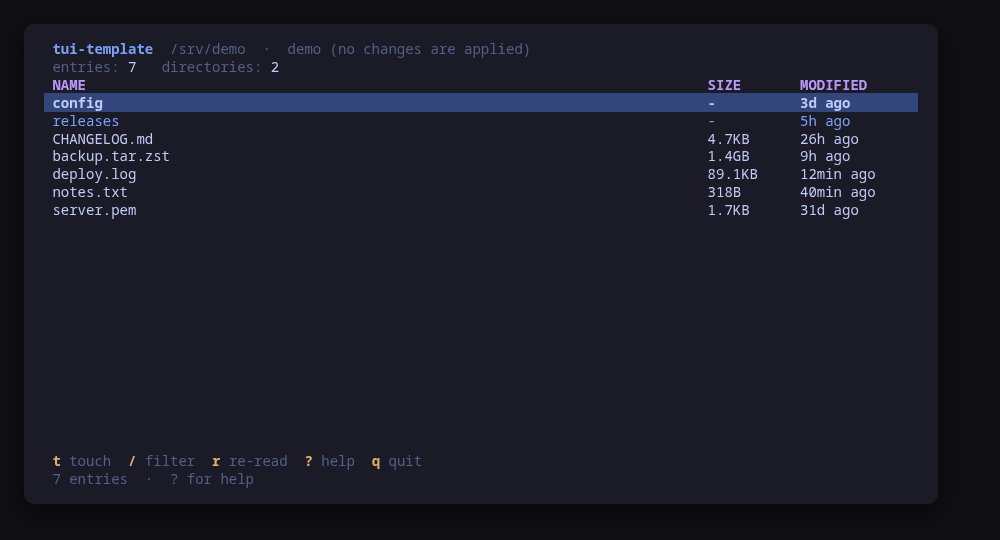
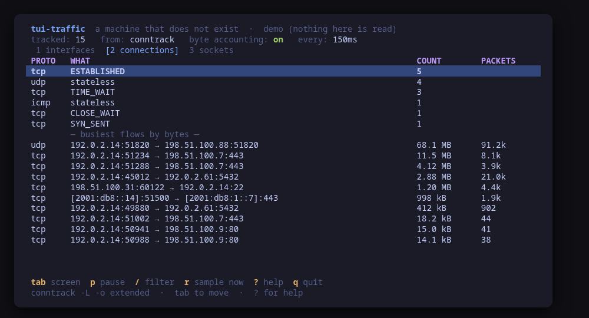

> **Unreleased.** This tool has not been tagged yet: there is no package and no
> binary to download, and the install section below says so. Build it from
> source, and expect keys and flags to move.

# tui-traffic

What the network is doing right now, on one Linux machine, in the terminal.
Part of the [tui-tools](https://github.com/tui-tools) family.

Three screens, refreshed every second, and every number on them comes from a
file the kernel already exports:

- **interfaces** — RX and TX in bytes per second and packets per second, a
  sparkline over the last minute, the link state, and the errors and drops the
  counters have accumulated. It is `/proc/net/dev` read twice a second apart,
  which is what a rate actually is.
- **connections** — the conntrack table summarised: states by protocol, the
  total, and the busiest talkers by bytes when the kernel is counting them.
- **sockets** — what is listening and what is established, from
  `/proc/net/tcp`, `tcp6`, `udp` and `udp6`.

It changes nothing. There is no action key, no confirm dialog, and the only
privilege it ever asks for is the `sudo -n` that reading the conntrack table
needs — which never prompts, so a machine where it does not work shows the
fallback and the reason instead of a password prompt.





```sh
make demo     # a fake machine with plausible moving numbers
```

## Install

<!-- install:start -->
<!-- Generated by tui-kit/tools/render-install.py from tool.json. -->
<!-- Edit the manifest, then run `make readme`. -->

### From source

```sh
git clone https://github.com/tui-tools/tui-traffic
cd tui-traffic && make build
sudo install -m0755 bin/tui-traffic /usr/local/bin/tui-traffic
```

Needs Go 1.27 or newer. This is the only way to run it today.

Not packaged for these yet; the static binary works everywhere in the meantime.

### Arch Linux — coming soon

Needs the tui-tools repository, which is a [one-time
setup](https://tui-tools.github.io/install/).

The one-liner detects the distribution and adds the repository and its signing
key:

```sh
curl -fsSL https://pkgs.tui.tools/install.sh | sh
```

Piping a script into a shell is not this family's style, so here is the same
setup by hand — read it, or read the script first with `curl -fsSL
https://pkgs.tui.tools/install.sh -o install.sh`:

```sh
curl -fsSL -o /tmp/tui-tools.asc https://pkgs.tui.tools/pubkey.asc
sudo pacman-key --add /tmp/tui-tools.asc
sudo pacman-key --lsign-key \
  "$(gpg --show-keys --with-colons /tmp/tui-tools.asc | awk -F: '/^fpr:/{print $10; exit}')"
printf '[tui-tools]\nServer = https://pkgs.tui.tools/arch/$arch\n' \
  | sudo tee -a /etc/pacman.conf
sudo pacman -Sy
```

Then, and for every other tool in the family:

```sh
sudo pacman -S tui-traffic
```

Nothing is published yet: tui-traffic is unreleased, and this channel turns
available with its first release.

### Debian and Ubuntu — coming soon

Needs the tui-tools repository, which is a [one-time
setup](https://tui-tools.github.io/install/).

The one-liner detects the distribution and adds the repository and its signing
key:

```sh
curl -fsSL https://pkgs.tui.tools/install.sh | sh
```

Piping a script into a shell is not this family's style, so here is the same
setup by hand — read it, or read the script first with `curl -fsSL
https://pkgs.tui.tools/install.sh -o install.sh`:

```sh
sudo install -d -m 0755 /etc/apt/keyrings
curl -fsSL https://pkgs.tui.tools/pubkey.asc \
  | sudo gpg --dearmor -o /etc/apt/keyrings/tui-tools.gpg
echo "deb [signed-by=/etc/apt/keyrings/tui-tools.gpg] https://pkgs.tui.tools/deb stable main" \
  | sudo tee /etc/apt/sources.list.d/tui-tools.list
sudo apt update
```

Then, and for every other tool in the family:

```sh
sudo apt install tui-traffic
```

Nothing is published yet: tui-traffic is unreleased, and this channel turns
available with its first release.

### Fedora and RHEL — coming soon

Needs the tui-tools repository, which is a [one-time
setup](https://tui-tools.github.io/install/).

The one-liner detects the distribution and adds the repository and its signing
key:

```sh
curl -fsSL https://pkgs.tui.tools/install.sh | sh
```

Piping a script into a shell is not this family's style, so here is the same
setup by hand — read it, or read the script first with `curl -fsSL
https://pkgs.tui.tools/install.sh -o install.sh`:

```sh
sudo rpm --import https://pkgs.tui.tools/pubkey.asc
sudo curl -fsSL -o /etc/yum.repos.d/tui-tools.repo https://pkgs.tui.tools/rpm/tui-tools.repo
sudo dnf makecache
```

Then, and for every other tool in the family:

```sh
sudo dnf install tui-traffic
```

Nothing is published yet: tui-traffic is unreleased, and this channel turns
available with its first release.

### Any distribution, static binary — coming soon

```sh
curl -fsSL https://github.com/tui-tools/tui-traffic/releases/download/v{version}/tui-traffic_{version}_linux_amd64.tar.gz | tar -xz tui-traffic
sudo install -m0755 tui-traffic /usr/local/bin/tui-traffic
```

There is no release yet. Build from source in the meantime.

### Verify a download

Every release of `tui-traffic` ships a `checksums.txt`. Check an archive
against it before installing:

```sh
sha256sum -c checksums.txt --ignore-missing
```
<!-- install:end -->

## Usage

```sh
tui-traffic                        # the three screens, refreshing every second
tui-traffic --demo                 # a fake machine, nothing on this one is read
tui-traffic --check                # one sample as JSON, then exit
tui-traffic --report               # print what a bug report needs, exit
tui-traffic --interval 2s          # sample every two seconds instead of one
tui-traffic --theme ~/mytheme/colors.toml
tui-traffic --version
```

### Keys

| Key | What it does |
| --- | --- |
| `1` `2` `3` | Interfaces, connections, sockets |
| `tab` / `shift+tab` | Next / previous screen |
| `p` | Pause and resume the refresh |
| `r` | Sample now, without waiting for the tick |
| `/` | Filter the rows |
| `?` | Help |
| `q` | Quit |

### `--check`, one sample as JSON

`--check` takes one sample of all three screens and prints it, then exits. It
starts no terminal program and changes nothing, so it is safe to run from a
script or from cron against a production machine. Two consecutive reads of
`/proc/net/dev` one interval apart are what the rates are computed from, so
`--check` takes about one interval to answer.

The `sources` block names where each screen's numbers came from, which is the
part a reader has to see: a connections summary built by counting sockets
because this machine has no conntrack is a different number from one read out
of the conntrack table, and the JSON says which it is.

### `--report`, for bug reports

`--report` prints, in one block, everything a maintainer would otherwise have
to ask for: the tool and kit versions, the conntrack version if there is one,
the distribution, the kernel, the terminal and the theme. It reads nothing
privileged, takes no sample, and carries no host name, user name or address, so
it can be pasted into a public issue as it is.

The two lines only this tool adds are the data sources it would use on this
machine, and whether conntrack byte accounting
(`net.netfilter.nf_conntrack_acct`) is on — which is the first thing to check
when the connections screen shows no bytes.

## Where the numbers come from

| Screen | Source | Privilege |
| --- | --- | --- |
| Interfaces | `/proc/net/dev`, `/sys/class/net/<if>/operstate` | none |
| Connections | `conntrack -L -o extended`, else `/proc/net/nf_conntrack`, else the socket tables | `sudo -n` for the first two |
| Sockets | `/proc/net/tcp`, `tcp6`, `udp`, `udp6` | none |

Nothing is cached across runs and nothing is written anywhere. The only state
the tool keeps is the last sixty samples per interface, in memory, which is
what the sparkline draws.

### When byte accounting is off

The kernel does not count bytes per connection unless
`net.netfilter.nf_conntrack_acct` is 1, and on most distributions it is 0. When
it is off, the connections screen shows the states and the counts and says
plainly that there are no byte figures — it does not estimate them. Turning it
on is a system change this tool does not make:

```sh
sudo sysctl -w net.netfilter.nf_conntrack_acct=1
```

## Compatibility

<!-- compat:start -->
<!-- Generated by tui-kit/tools/render-compat.py from tool.json. -->
<!-- Edit the manifest, then run `make readme`. -->

`tui-traffic` probes its backend once at startup and shows the version in the
header. A version nobody has tested is marked `(untested)` there rather than
hidden; one below the minimum is marked as such and the tool still runs.

### conntrack

| | |
| --- | --- |
| Binary | `conntrack` |
| Version read with | `conntrack --version` |
| Minimum | 1.4.0 |
| Tested | none yet |

| Versions | What changes |
| --- | --- |
| `<1.4.0` | `conntrack -L -o extended` prints a layout this parser does not read, so the connections screen falls back to /proc/net/nf_conntrack or to counting sockets, and says which it used |

The tested versions are generated from `compat/results.jsonl`, which the tool's
own smoke test appends to when it runs against a real machine in
[tui-lab](https://github.com/tui-tools/tui-lab).
<!-- compat:end -->

## The family rules this tool keeps

- **Read-only.** Not "read-only by default": there is no mutation at all, no
  action key and no confirm dialog. The preview-and-confirm contract holds
  vacuously, because nothing is ever run that changes anything.
- **No daemon, no state of its own.** The kernel is the source of truth and it
  is re-read every tick.
- **`--demo` always works**, against a fake machine whose numbers move, so the
  UI can be reviewed without a machine to look at.
- **Backend behind an interface.** The UI never names a file or a binary.
- **English everywhere**: code, comments, commits, UI strings.
- **Responsive.** The layout adapts from a 40-column pane to a full screen.

## Contributing

Contributions arrive as pull requests: [tui-kit's
CONTRIBUTING.md](https://github.com/tui-tools/tui-kit/blob/main/CONTRIBUTING.md)
is the family's process. A security problem is reported the way [tui-kit's
SECURITY.md](https://github.com/tui-tools/tui-kit/blob/main/SECURITY.md)
describes, privately, never in a public issue.

## License

MIT — see [LICENSE](LICENSE). Part of the
[tui-tools](https://github.com/tui-tools) family.
